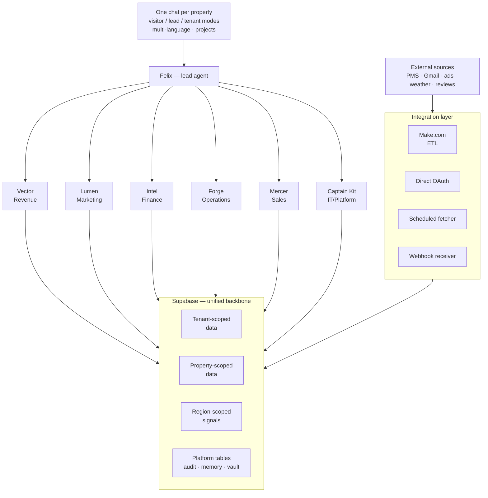

# ARCHITECTURE.md — The Beyond Circle platform

> Canonical architectural reference for The Beyond Circle's hospitality
> intelligence platform.
>
> Source of truth for *what we are building*. Behavior rules live in
> `CLAUDE.md`. Design / UI rules live in `DESIGN_NAMKHAN_BI.md`. Live state
> lives in Supabase (`v_session_context`, `cockpit_audit_log`,
> `documentation.documents`).
>
> Architect: PBS (Paul Bauer). Version: 0.2. Status: active.

---

## 1. Identity

**The Beyond Circle (TBC)** is a hospitality holding and product company.
Two activities under one roof:

- **Owner-operator** of luxury boutique hotels (currently: The Namkhan
  in Luang Prabang, Laos — jungle, 24 rooms, SLH-affiliated; and Donna
  Portals in Spain — beach lifestyle, 5★).
- **Product vendor** of a modular hospitality intelligence platform sold
  to other hotel owners and operators.

The platform powers our own properties first, then external clients. The
validation gate is "run our own hotels with it" before "sell it."

---

## 2. Mission

**Build a conversational operating system for hotels.**

One chat per property — multi-language — that holds every piece of
operational data, correlates across domains automatically, and is staffed
by learning agents that propose actions and execute the approved ones.
The answer comes back in the form the operator needs: a number, a P&L,
a campaign brief, a kanban, a chart, a one-line answer. Reports and
dashboards are *outputs* — generated on demand — not destinations.

Not BI in the common sense. The hotel, talking back. The owner-operator
is freed from tab-switching and reconciling — time goes to strategy and
exceptions only.

---

## 3. Product shape

The product is one chat. Everything else exists to make that chat
useful.

### 3a. One chat, three modes

| Mode | Who | Identity | Data access | Memory |
|---|---|---|---|---|
| **Visitor (Phase 2+)** | Anonymous public web visitor | None / cookie | None — global agent knowledge only | Session-only |
| **Lead (Phase 2+)** | Signed up, not paying | Account, no tenant | None | Persistent, lead-scoped |
| **Tenant operator** | Paying customer or own property | Account + tenant + property | Full data within tenant scope | Persistent, tenant-scoped |

Same chat interface. Same agent code. Three different data-access
policies. Memory transfers when a visitor becomes a lead becomes a
tenant — the conversation continues across the conversion.

### 3b. Projects and conversations

Like claude.ai — but a project = a persistent operator context bucket.

- A project holds conversations, attached files, custom instructions,
  and project-scoped memory.
- Operator examples:
  - "2026 Direct-booking growth strategy"
  - "Q1 F&B menu refresh"
  - "Donna Portals soft launch"
- Conversations within a project share context and memory.
- Outside of a project: ad-hoc chat, scoped to property only.

### 3c. Artifacts rendered inline

Replies are not always text. The agent decides which artifact best
answers the question, composes it inline, and offers it for save /
schedule / project-attach.

Standard artifact types:

- **Number** (one figure + delta)
- **Brief** (signal · good · bad · proposals)
- **Table** (sortable, filterable)
- **Chart** (line / bar / scatter)
- **P&L view** (USALI-aligned)
- **Kanban** (proposal / in_process / done)
- **Map** (geographic — pickup, compset)
- **Itinerary / SOP deck** (graphical, for low-literacy staff)

Each artifact carries the same four actions: AI iterate, save to
Reports, schedule, attach to Project.

### 3d. Memory — the hotel remembers

Every chat turn fetches relevant memory via vector similarity on the
user's message + recent-by-time fallback. Memory is structured:

| Class | Examples | Scope |
|---|---|---|
| Hard facts | Room count, brand voice, signature features | property |
| Patterns observed | "No-show spike after Boun Awk Phansa" | property |
| Operator preferences | "I want ADR not RevPAR for daily glance" | property + user |
| Outcomes | "Songkran 2025 campaign delivered 38 direct bookings" | property |
| Platform rules | "USALI 11th ed accounting standard" | platform |

Memory is importance-weighted and embedded into pgvector. The
`embed-kb` job (already running every 15 min) keeps the index current.

### 3e. Multi-language

Day-one languages: **English, Spanish, Lao, German.**

Three translation surfaces:

| Surface | What's translated | Where it lives |
|---|---|---|
| UI chrome | Buttons, labels, navigation | i18n catalog files (`locales/<lang>.json`) |
| Agent responses | Live AI output | Agent generates in user's language — system prompt instruction + per-turn detection |
| Content / brand voice | Property descriptions, marketing copy, guest comms, SOPs | Stored per property per language in `content.*` tables |

Special case — **Lao for low-literacy operator staff:** graphical SOP
decks with minimal text. Stored as image assets in Supabase storage,
language-tagged, rendered as decks via the SOP module.

### 3f. The conversion funnel is the product

Phase 2 onward: the public chat **is** the marketing. Vector at
beyondcircle.com talks freely with global revenue-management knowledge;
gets sharper as the visitor shares context about their property; at the
right moment surfaces: "I can keep going, but to give specific advice I
need your data — sign up and I'll continue with your numbers."

Conversion is movement up the modes (visitor → lead → tenant). The
chat is the same chat the whole way.

### 3g. Agents in two knowledge modes

Each agent operates in two modes:

| Mode | What the agent knows | What it can do |
|---|---|---|
| **Generic expertise** | Global domain knowledge (revenue management, marketing, finance, operations) | Answer textbook questions, explain concepts, discuss strategy |
| **Property-grounded** | Generic + this property's data, history, brand, memory | Specific advice, proposals, monitoring, action |

Sharpening is continuous, not a switch. Vector in visitor mode can
already get much sharper just from what the visitor types ("we have 40
rooms in Bali, 60% occupancy"). The continuous sharpening curve is the
conversion engine.

### 3h. Trust unlocking auto-run

Agents earn auto-run by track record per (agent_role, action_type)
pair. Default threshold: 10 successful proposals approved, zero
rejections. One rejection re-locks. Approval-required-always at start;
trust meter only ever unlocks auto-run, never the other way around.

---

## 4. Phasing

The platform builds in three phases. Architectural decisions are
phased to match — over-building Phase 3 plumbing in Phase 1 is wasted
work; under-building Phase 1 plumbing makes Phase 2 painful.

| Phase | Window | Audience | Goal |
|---|---|---|---|
| **1** | Now → ~M2 | Internal (Namkhan + Donna) | Make it work for our own hotels |
| **2** | ~M2 → ~M6 | Public + external clients via Vector | Open Revenue Management to the world |
| **3** | ~M6+ | All modules public-facing | Suite + multi-agent landing |

### Phase 1 priorities

- Chat + agents excellent for owner-operators
- Data integrations solid (Cloudbeds, Gmail, signals)
- Memory + correlation layer producing real insight
- Multi-tenant + multi-language proven via Namkhan and Donna
- USALI consolidation to Beyond Circle level

### Phase 2 priorities

- Public agent demo + conversion funnel
- Self-service signup + data-onboarding wizard
- Stripe billing (Tier 2 module subscription + Tier 3 single runs)
- Public-AI hardening (prompt injection, rate limits, watermarking)
- First public-facing agent: Vector (Revenue Management)

### Phase 3 priorities

- Open Lumen, Intel, Forge, Mercer to public landing experiences
- Suite upsell + Felix-as-chief-of-staff for paying clients
- Multi-agent inter-collaboration on cross-domain questions
- Trust meters unlocking auto-run in production at scale

---

## 5. Commercial tiers

Tiers are **stages of relationship**, not feature packages.

| Tier | Identity | What the chat does |
|---|---|---|
| **0 — Visitor (Phase 2+)** | Anonymous | Agent answers from global knowledge; sharpens as visitor shares context |
| **1 — Lead (Phase 2+)** | Signed up, no payment | Agent remembers across sessions; can offer single-runs |
| **2 — Single-run customer (Tier 3)** | Paid for one job | Agent completes deliverable, conversation continues |
| **3 — Module subscriber (Tier 2)** | Paying monthly, one module live | Agent has property data for their module; monitoring + proposals active |
| **4 — Suite subscriber (Tier 1)** | Paying monthly, all modules | Felix orchestrates whole team; full cockpit; trust meters unlocking auto-run |

Conversion is movement up the stages. Single-runs are in-chat upsells,
not a separate engine: "I can restructure this P&L into USALI as a
one-off — €X, paid in chat, delivered in 24h. Or sign up and I'll do
it monthly."

---

## 6. Entity hierarchy

```
THE BEYOND CIRCLE  (us, parent, architect)
        │
        ├── Tenant: tbc_namkhan
        │       └── Property: The Namkhan (Luang Prabang, Laos)
        │               └── Modules: ALL (full suite, reference impl)
        │
        ├── Tenant: tbc_donna
        │       └── Property: Donna Portals (Spain, beach lifestyle)
        │               └── Modules: ALL (rolling out Phase 1)
        │
        ├── Tenant: external_client_N  (Phase 2+)
        │       ├── Property A (Modules: revenue only)
        │       └── Property B (Modules: revenue + marketing)
        │
        └── Single-Run customers (no tenant binding)
                └── Ephemeral `run_id` records in `runs.*` schema
```

**Hard rule:** every operational table carries `tenant_id` AND
`property_id`. RLS policies enforce both. Single-run data lives in a
separate `runs.*` schema and never touches multi-tenant operational
space.

**Namkhan and Donna are different tenants by design** — different legal
entities, different operating currencies (LAK vs EUR), different
jurisdictions. They roll up to The Beyond Circle via internal
aggregation views (`SECURITY DEFINER`, explicit `GRANT`s). This proves
multi-tenant isolation works before any external client touches the
system.

---

## 7. Shared structure, isolated content

Namkhan and Donna are both 5★ boutique hotels with the same DDL.
Reservations table is the same. USALI formulas are the same. ADR is
ADR.

But **the content is 100% different**: jungle vs beach, Laos vs Spain,
LAK vs EUR, completely separate brand voice, photography, room
descriptions, F&B menus, signature drinks, campaign copy.

This is the platform's central design test.

| Layer | Shared | Different |
|---|---|---|
| Schema (DDL) | ✅ Identical | — |
| KPI formulas (ADR, RevPAR, USALI) | ✅ Identical | (numbers differ) |
| Agent personas (Felix, Vector, etc.) | ✅ Same code | Property context injected per turn |
| Brand tokens (palette, typography, logo) | — | 🔴 Completely different |
| Voice / tone (guest comms, marketing) | — | 🔴 Completely different |
| Campaign **templates** | ✅ Framework shared | — |
| Campaign **instances** | — | 🔴 Content 100% different |
| F&B menus, room descriptions, story | — | 🔴 Completely different |
| Compset, region, signals | — | 🔴 Asia vs Europe |
| Currency | ✅ Engine | 🔴 Operating differs (LAK vs EUR) |
| Regulations | — | 🔴 Lao vs Spanish |

**Implication:** there is a `tenancy.property_context` table that every
agent loads before doing anything property-specific. It injects brand,
voice, location, currency, room context, signature features into the
agent system prompt at runtime. Vector at Namkhan and Vector at Donna
are the same Vector code with different context — same as a consultant
walking into two different hotels.

---

## 8. High-level architecture diagram

```
┌────────────────────────────────────────────────────────────────────────┐
│                      ONE CHAT PER PROPERTY                             │
│   (visitor / lead / tenant modes — multi-language — projects)          │
│                                                                        │
│   Inline artifacts: number · brief · table · chart · P&L · kanban      │
└────────────────────────────────────────────────────────────────────────┘
                                  │
                                  ▼
┌────────────────────────────────────────────────────────────────────────┐
│                  LEAD AGENT  (Felix per tenant)                        │
│  Parses intent · fetches memory · dispatches to specialists ·          │
│  composes response · logs to audit + memory                            │
└────────────────────────────────────────────────────────────────────────┘
                                  │
       ┌──────────────┬───────────┴───────────┬──────────────┐
       ▼              ▼                       ▼              ▼
   ┌────────┐    ┌────────┐              ┌────────┐    ┌────────┐
   │ Vector │    │ Lumen  │              │ Intel  │    │ Forge  │
   │revenue │    │market  │              │finance │    │ ops    │
   └────────┘    └────────┘              └────────┘    └────────┘
       │              │                       │              │
       └──────────────┴──────────┬────────────┴──────────────┘
                                 ▼
            ┌─────────────────────────────────────────┐
            │           UNIFIED DATA BACKBONE         │
            │              (Supabase)                 │
            │                                         │
            │  Tenant-scoped:  reservations,          │
            │                  transactions,          │
            │                  email, P&L, etc.       │
            │                                         │
            │  Property-scoped:  property_context,    │
            │                    rooms, rate plans    │
            │                                         │
            │  Region-scoped:   signals.* (weather,   │
            │                   flights, FX)          │
            │                                         │
            │  Platform:       audit_log, change_log, │
            │                  agent_memory,          │
            │                  documentation, vault   │
            └─────────────────────────────────────────┘
                                 ▲
       ┌──────────┬──────────────┴──────────────┬──────────┐
       │          │                             │          │
   ┌───────┐ ┌─────────┐               ┌─────────────┐ ┌─────────┐
   │ Make  │ │  Direct │               │  Scheduled  │ │ Webhook │
   │  ETL  │ │  OAuth  │               │   fetcher   │ │receiver │
   └───────┘ └─────────┘               └─────────────┘ └─────────┘
       │          │                             │          │
   PMS, QB,   Gmail, GA4,                  Weather,     TripAdvisor
   Roots,     Search Console,              flights,     reviews,
   Factorial, ad platforms                 FX, events   booking pings
   bank feeds
```

Mermaid version (renders in GitHub previews):



---

## 9. Data classes

Five distinct data classes with different scope and isolation rules.

| Class | Scope | RLS key | Examples |
|---|---|---|---|
| **Tenant operational** | tenant_id + property_id | both | reservations, transactions, emails, P&L, staff |
| **Property reference** | property_id | property_id | rooms inventory, rate plans, room types |
| **Property content** | property_id | property_id | brand voice, room descriptions, F&B menus, marketing copy |
| **Region / shared** | region_code or global | none / region | weather, FX, flight schedules, holidays |
| **Single-run** | run_id (ephemeral) | run_id | Tier 3 uploads + AI deliverables |

**Hard rule:** Beyond Circle internal aggregation views are the only
place cross-tenant joins happen. They use `SECURITY DEFINER` with
explicit `GRANT`s. Tenants never see other tenants' data, ever.

---

## 10. Module catalog

Modules are the unit of subscription. A property has zero or more
enabled modules. Agents are gated by module.

| module_key | Name | Schemas | Agents | Required integrations |
|---|---|---|---|---|
| `pms_cloudbeds` | PMS — Cloudbeds | public.reservations etc. | (data only) | Cloudbeds via Make |
| `pms_mews` | PMS — Mews | mews.* | (data only) | Mews via Make |
| `revenue` | Revenue Management | revenue.* | Vector | active PMS module |
| `sales` | Sales pipeline | sales.* | Mercer | Gmail OAuth |
| `finance` | Finance / USALI | finance.* | Intel | QuickBooks OR manual |
| `operations` | Operations / Staff | ops.* | Forge | none |
| `fnb` | F&B / POS | fnb.*, pos.* | (operations-shared) | Roots POS |
| `marketing` | Marketing Analytics | marketing.* | Lumen | Meta + Google OAuth |
| `reviews` | Reputation | reviews.* | (marketing-shared) | TripAdvisor + Google webhooks |
| `hr` | HR / Payroll | hr.* | (operations-shared) | Factorial OR manual |
| `frontoffice` | Guest comms / pre-arrival | frontoffice.* | (sales-shared) | Gmail OAuth |
| `platform` | Cockpit core | cockpit_* | Felix, Captain Kit | always on |

**Agent gating:** if a property doesn't have a module enabled, the
agent that owns it cannot act for that property. Felix at a property
with only `revenue` enabled politely refuses non-revenue requests and
suggests upgrade.

---

## 11. Onboarding data contracts

Each module has a data contract: what the agent must have to be useful,
recommended to be good, and aspirational to be excellent. The contract
becomes the **onboarding checklist** the wizard walks a new tenant
through when they subscribe to that module.

### 11.1 Revenue module data contract (Phase 2 launch)

**Tier A — required for Vector to be useful**

| Data | Source | Why |
|---|---|---|
| Room inventory (types, counts, statuses) | PMS | Can't compute ADR / RevPAR without it |
| Reservations (forward + ≥13 months history) | PMS | OTB, year-over-year, demand patterns |
| Daily room nights sold + revenue (≥13 months) | PMS or derivable | KPI engine |
| Rate plans + restrictions | PMS | Pricing decisions need current state |
| Channel mix (direct / OTA breakdown) | PMS | Mix optimisation is core to RM |
| Property metadata (location, star rating, room count) | Manual / PMS | Context for agent reasoning |
| Currency + tax/VAT setup | Manual | Numbers need to be meaningful |

**Tier B — recommended for Vector to be good**

| Data | Source | Why |
|---|---|---|
| Compset / rate-shopper data | Integration OR manual | Pricing in a vacuum is useless |
| Cancellation + no-show history | PMS | Net pickup analytics |
| Lead-time distribution | PMS-derivable | Booking pace forecasting |
| Length-of-stay patterns | PMS-derivable | Restriction strategy |
| OTA commission config | Manual | True net-revenue analysis |
| Marketing spend by channel | Marketing module OR manual | Net contribution per channel |

**Tier C — aspirational for actionable proposals**

| Data | Source | Why |
|---|---|---|
| Daily pickup snapshots | PMS / scheduled fetcher | Trend detection |
| Flight schedules + arrivals (region) | Signals layer | Demand forecasting |
| Weather + events (region) | Signals layer | Compression signals |
| FX rates (tenant's reporting currency) | Signals layer | Cross-currency reporting |
| Reviews / reputation score | Reviews module | Pricing power |
| F&B + ancillary revenue per stay | F&B module / POS | TrevPAR vs RevPAR |

Phase 2 minimum public launch = Tier A required, Tier B strongly
recommended (manual entry acceptable), Tier C deferred but architected.

### 11.2 Other modules — TBD

Marketing, Finance, Operations, Sales, Reviews each get their own
contract before public launch of their module. These are deferred to
Phase 3.

---

## 12. Integration patterns

Six distinct patterns. Each has different ops burden, security model,
and failure mode.

### 12a. Make-mediated

PMS, accounting, HR, POS, bank feeds. Connector credentials in Make
Connections. Scenarios exported to `cockpit/integrations/make/*.json`
and version-controlled. Every scenario change writes
`cockpit_change_log`. ADR required for a new source. Phase 1: shared
Make org with tenant_id routing. Phase 3: migrate paying clients to
their own Make org for isolation.

### 12b. Direct OAuth (in-app)

Gmail, GA4, Search Console, Meta Ads, Google Ads. OAuth flow lives in
the Next.js app. Tokens in `<schema>.<source>_connections`, encrypted
via Supabase Vault. We own the credential lifecycle.

### 12c. Scheduled fetcher (region-scoped)

Weather, flight schedules, FX, holidays, event calendars. Single shared
API key per source. Region-keyed (`signals.*.region_code`). Properties
join via `tenancy.properties.region_code`. Failure mode: stale, not
broken.

### 12d. Webhook receiver

TripAdvisor (planned), Google reviews (planned), booking-engine
notifications (future). Per-tenant unique webhook URLs with
tenant_id-bound secrets. Validate signature, never execute payload
content.

### 12e. Discretionary / exploratory sources

Public or semi-public sources we add opportunistically. Currently on the
watchlist: **GA4, Google Search Console, Google Tag Manager (write
surface — see 12f), Booking.com / Expedia / Agoda public reviews, OAG /
FlightAware, OpenWeather / NOAA / regional met agencies, public FX feeds
(ECB / IMF), tourism arrivals data (Lao gov, ASEAN stats, Spanish INE),
compset OTA pricing snapshots, event / festival / cultural / religious
calendars.**

Rules:

1. ADR required before integration.
2. Lands in `signals.*` or `external.*` — never in tenant-owned tables.
3. Region-scoped or globally-scoped, unless data is specifically
   tenant-bound.
4. Owns its own freshness watermark in `sync_watermarks`.
5. Failure mode is "stale, not broken."
6. Reviewed quarterly: still feeding a live decision? If not, kill.

Tier 2 / Tier 3 clients may pay to enable specific discretionary
sources for their property.

### 12f. Outbound write surfaces

Tools the cockpit *writes to*, not reads from. Different security
review.

| Tool | Purpose | Status |
|---|---|---|
| GTM | Push tag configurations | Planned |
| Klaviyo / Mailchimp | Audience pushes (deferred — marketing module is read-only) | Deferred |
| Future: social posting, OTA inventory pushes, content publishing | TBD | Future |

Leaked write-surface tokens are higher risk than leaked read tokens.
Each gets its own ADR before enabling.

---

## 13. Source-of-truth rules

When the same kind of data could come from multiple sources, the
architecture picks one per tenant/property and binds it explicitly.

| Concern | Column | Allowed values |
|---|---|---|
| PMS | `tenancy.properties.pms_source` | `cloudbeds`, `mews`, future |
| Accounting | `tenancy.tenants.accounting_source` | `quickbooks`, `xero`, `factorial_accounting`, `manual_upload` |
| HR / Payroll | `tenancy.tenants.hr_source` | `factorial`, `manual` |
| POS | `tenancy.properties.pos_source` | `roots`, future |
| Email (sales) | `tenancy.properties.email_source` | `gmail`, future |
| Operating currency | `tenancy.properties.currency_operating` | LAK, EUR, USD, etc. |
| Reporting currency | `tenancy.tenants.currency_reporting` | USD (default for TBC tenants) |
| Region (signals) | `tenancy.properties.region_code` | e.g. `LA-LPQ`, `ES-AND` |

Agents and views read these columns and dispatch to the right schema.
**Never assume Cloudbeds. Never hardcode property_id past this point.**

---

## 14. Forward-writing discipline

Every change to the system writes itself forward so the next session,
next agent, next property build inherits context. Enforced via Postgres
triggers, not convention.

| What | Table | Who writes |
|---|---|---|
| Every agent action / tool call / merge / sync run | `cockpit_audit_log` | All agents, runner, chat |
| Every state change (DDL, code merge to main, important memory writes, integration changes) | `cockpit_change_log` | DDL event trigger (live since 2026-05-11) + manual hooks |
| Significant architectural decisions | `cockpit_decisions` (ADR table, planned) | Architect (PBS), agents proposing |
| End-of-session handoffs | `documentation.documents` + `document_versions` | Last agent / session close |
| Agent learnings, rules, preferences | `cockpit_agent_memory` (importance-weighted) | Agents on insight; PBS on policy |

**Hard rule:** if it isn't in one of these tables, it didn't happen.
Triggers should refuse changes that bypass the audit path.

---

## 15. Property registry

| tenant_id | property_id | name | location | type | rooms | PMS | Op. currency | brand | tier | status |
|---|---|---|---|---|---|---|---|---|---|---|
| `tbc_namkhan` | `260955` | The Namkhan | Luang Prabang, Laos | Jungle boutique 5★, SLH | 24 | cloudbeds | LAK | the_namkhan | 1 | Live (reference) |
| `tbc_donna` | TBD | Donna Portals | Spain (beach) | Beach lifestyle 5★ | TBD | TBD | EUR | the_donna_portals | 1 | Phase 1 — onboarding |
| external_1 | TBD | (future client) | TBD | TBD | TBD | TBD | TBD | TBD | 2 or 3 | Phase 2+ |

---

## 16. Brand stack

| Surface | Brand |
|---|---|
| Public site (beyondcircle.com) | The Beyond Circle |
| Tenant cockpit (logged-in client) | Co-branded: TBC small + tenant brand large |
| Property cockpit | Property brand (Namkhan / Donna / client property) + SLH where applicable |
| Single-run deliverable | The Beyond Circle |

Brand tokens live in `platform.brands`; properties join via `brand_id`.
Phase 1 brands defined: `the_beyond_circle`, `the_namkhan`,
`the_donna_portals`.

---

## 17. Agent architecture

### 17a. Felix — chief of staff

Per-tenant lead agent. Parses intent, fetches relevant memory,
dispatches to specialists, composes the response, logs to audit.
Always-on (platform module). Never gated by other modules.

### 17b. Specialist agents

| Agent | Role | Module | Public-landing target |
|---|---|---|---|
| Vector | Revenue management | revenue | Phase 2 — first public |
| Lumen | Marketing | marketing | Phase 3 |
| Intel | Finance / USALI | finance | Phase 3 |
| Forge | Operations / staff | operations | Phase 3 |
| Mercer | Sales / groups | sales | Phase 3 |
| Captain Kit | IT / platform | platform | Internal only |

### 17c. Reasoning patterns

- **Single-domain:** "What's MTD occupancy?" → Vector queries
  `v_kpi_daily`, returns number.
- **Cross-domain:** "Why was last week's RevPAR soft?" → Felix consults
  Vector (RevPAR), Lumen (campaign performance), signals (weather,
  flights), composes Brief.
- **Monitoring loop:** Vector runs daily, scans `v_kpi_daily`,
  `sync_watermarks`, `pickup_snapshots`. Writes proposals into the
  agent's queue. Operator approves / rejects.

### 17d. Proposal lifecycle and trust

Atomic unit of agent work: `cockpit_proposals` row.

```
signal + agent_role + action_type + body + action_payload + status
                                                          (proposal / in_process / done / rejected)
```

Trigger `proposals_bump_trust` updates `agent_trust` counters on status
flips. Trust unlocks auto-run per (agent_role, action_type) pair after
threshold (default 10 approvals, zero rejections). One rejection
re-locks. **Approval-required-always at start; trust meter only ever
unlocks auto-run.**

### 17e. Module gating

Enforced in the chat handler before any agent runs: if
`tenancy.property_modules.module_key` doesn't exist for that property,
the agent is unavailable.

---

## 18. Stack (authoritative)

| Layer | Tech |
|---|---|
| Frontend | Next.js 14 (App Router) / React |
| Hosting | Vercel (Pro) — team `pbsbase-2825s-projects`, project `namkhan-bi` |
| Database | Supabase (Pro) — project `namkhan-pms` (id `kpenyneooigsyuuomgct`), region `eu-central-1` |
| Integration ETL | Make.com (Pro) |
| AI | Anthropic Claude (Sonnet 4.5 for chat/runner; ZDR for production calls — ADR-002) |
| CI/CD | GitHub Actions + Vercel auto-deploy from `main` |
| Monitoring | Vercel Speed Insights, Web Analytics, Vercel Agent |
| Secret storage | GitHub Secrets, Vercel env vars, Supabase Vault, Make Connections |
| Billing | Stripe (Phase 2+) |

No new tools without an ADR.

---

## 19. Security + reliability baseline

### 19a. What is LIVE today

| Control | Status | Where |
|---|---|---|
| **Daily backups** (7-day retention) | ✅ ON | Supabase Pro default |
| **Point-in-Time Recovery (PITR)** | ✅ ON (7-day window) | Enabled 2026-05-11. Restore to any second in last 7 days. ~$100/mo. |
| **DDL audit trail** | ✅ ON | `cockpit_change_log` + event triggers `cockpit_log_ddl_end` / `cockpit_log_sql_drop`. View: `v_change_log_recent`. 90-day retention, daily prune. |
| **Compute headroom** | ✅ Medium (4 GB RAM) | Upgraded 2026-05-11 from Micro. Headroom for materialized view refreshes + Donna onboarding load. |
| **RLS on operational tables** | ✅ Partial | Multi-tenant Phase 2.x migrations (2026-05-05) added `tenant_id` columns + policies across operational schemas. Full RLS sweep pending Phase 1 close-out. |
| **Service-role key boundary** | ✅ Enforced | Never reaches the browser; server-side routes only. |
| **GitHub secret scanning + push protection** | ✅ ON | Default GitHub features. |
| **Vercel log redaction** | ✅ ON | Default Vercel Pro behaviour. |

### 19b. What is PLANNED (ADR-002 — to ratify before public launch)

- **`gitleaks` pre-commit hook (local) + CI step** before any PR can merge.
- **Per-tenant credentials in Supabase Vault**, accessed only via
  `SECURITY DEFINER` functions. Replace any tokens currently in env vars.
- **Anthropic Zero Data Retention** enabled for production API calls.
- **Audit log redaction layer**: regex scrub of known token patterns
  before insert into `cockpit_audit_log`.
- **Tenant key rotation policy**: on churn, all credentials rotated
  within 24h. Documented runbook.
- **Public chat hardening**: prompt injection guardrails, per-IP rate
  limits + token budget caps, human reviewer queue, watermarking on
  free outputs.
- **2FA enforcement** on every Supabase org member (owner + developer).
  Owner = `data@thedonnaportals.com` is single point of failure.
- **Network restrictions** (IP allowlist) for direct DB connections —
  currently open.
- **Spending cap + usage alerts** at org level to prevent runaway-query
  cost surprises.
- **Disk autoscale**: currently capped at 8 GB by spend cap. Must raise
  to 16+ GB and disable cap before Donna onboarding (Donna ~15× data
  volume).

### 19c. Backup posture in plain language

| Failure mode | What recovers it | RPO (data lost) | RTO (time to recover) |
|---|---|---|---|
| Bad migration / silent corruption noticed within 7 days | PITR restore to the second before | seconds | ~30 min |
| Bad migration noticed after 7 days | Daily backup (oldest = 7 days) | up to 24h | ~30 min |
| Entire project wipe / region outage | Daily backup, restore to a new project | up to 24h | ~hours |
| Cloudbeds reservation data lost | Re-sync from Cloudbeds API (source of truth) | none | hours, watermark-driven |
| Manually-entered platform data (USALI maps, budgets, agent memory, docs) lost beyond PITR window | Weekly off-Supabase dumps (planned — `cockpit/snapshots/*.sql.gz` in repo) | up to 7 days | minutes |

Phase 1: this is acceptable. Phase 2 (public, paying clients): tighten
RPO via 14-day PITR or self-hosted replica.

---

## 20. Decision log

This file is the architectural snapshot. The full decision trail lives
in `cockpit_decisions` (planned ADR table).

| ADR | Title | Status |
|---|---|---|
| ADR-001 | Multi-tenant, modular, three-tier commercial architecture | Draft (this doc) |
| ADR-002 | Security baseline (gitleaks, vault, ZDR, redaction, public-AI hardening) | Planned |
| ADR-003 | Make.com per-tenant scenario isolation model | Planned |
| ADR-004 | PMS source-of-truth column + dispatch pattern | Planned |
| ADR-005 | Single-run engine (Tier 3) — in-chat upsell, not separate engine | Planned |
| ADR-006 | Public chat conversion funnel + visitor/lead/tenant mode | Planned |
| ADR-007 | Multi-language strategy (EN, ES, LO, DE day-one) | Planned |
| ADR-008 | Infra baseline: Medium compute, 7-day PITR, DDL audit (`cockpit_change_log`) | Live (2026-05-11) |

---

## 21. What does NOT belong here

- Component-level UI rules → `DESIGN_NAMKHAN_BI.md`
- Communication style + agent behavior rules → `CLAUDE.md`
- Task-specific standards → `cockpit/standards/`
- Live state (what exists right now, what's in flight) → query
  Supabase: `v_session_context`, `cockpit_audit_log`,
  `documentation.documents`
- Personas / voice for chat agents → wired in code at
  `app/api/cockpit/chat/route.ts`
- Commercial pricing per tier → not architectural

This doc captures *structure*. Behavior, design, and state live
elsewhere.

---

## Update history

| Date | Change | Author |
|---|---|---|
| 2026-05-11 | Initial draft v0.1 | PBS + Claude |
| 2026-05-11 | v0.2 — product-led restructure: chat is the surface; phased build (Phase 1/2/3); shared structure isolated content; onboarding data contracts; multi-language; agents in two knowledge modes; conversion funnel | PBS + Claude |
| 2026-05-11 | v0.3 — infra baseline live: compute Micro→Medium, 7-day PITR enabled, `cockpit_change_log` + DDL event triggers shipped. §19 split into Live/Planned. ADR-008 added. | PBS + Claude |
