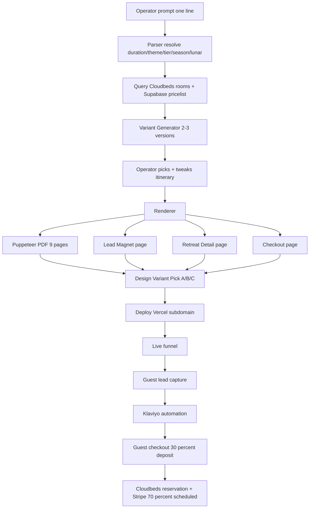

# Retreat Package Compiler & Funnel Builder

**Maps to:** parent spec `feature-builder/inbox/retreat-compiler-spec.md` (full doc) + addendum `feature-builder-addendum-01-sheet-and-schemas.md` (schemas).
**Slug:** `retreat-compiler`
**Property:** Namkhan v1, Donna v1.1 (theme pack fork)

---

## Problem

Building a retreat package today: 2–3 days in Google Sheet "Namkhan Packages 1.2" (math, variants, margins) + 1–2 weeks in Canva/Figma to produce the brochure PDF + landing pages, then a manual checkout cobbled from email + Stripe link + Cloudbeds reservation entered by hand. Conversion leaks at every handoff. WeTravel does the productized version for tour operators at $49+/op/month plus 2.5% per booking — but locks brand, owns the customer relationship, and has no Cloudbeds integration. We want one prompt → branded PDF + 3-page funnel + Cloudbeds-bridged checkout, owned end-to-end. The Sheet already has 80% of the logic; this productizes it.

## User Flow

1. Operator types one line: `5 day mindfulness retreat — lux only — green season — 8 pax`
2. Compiler parses prompt → resolves theme/tier/season/lunar → queries Cloudbeds for room avail + Supabase `pricelist` for activities/spa/F&B
3. Generates 2–3 variants (room category × activity intensity × F&B inclusion); each card shows total USD, per-pax, margin %, occupancy assumption
4. Operator picks a variant → tweaks day-by-day (drag activities, swap rooms, flag opt-outs)
5. Compiler renders: branded PDF (Puppeteer 9-page template), 3 funnel pages (lead magnet → retreat detail → checkout), deploy bundle
6. Operator picks design variant (A: editorial/Soho House · B: minimalist/Aman · C: bold/conversion)
7. One-click deploy → Vercel subdomain `mindfulness-summer.thenamkhan.com`
8. Lead magnet captures email → Klaviyo automation (8-touch lunar/mindfulness series) → retreat detail → Stripe 30/70 deposit → Cloudbeds reservation auto-created on payment

## Data Model Delta

All schemas already in addendum 01. v1 adds two operational tables:

| Table | Action | Columns |
|---|---|---|
| `activities` | NEW | per addendum 3.1 |
| `spa_menu` | NEW | per addendum 3.2 |
| `fnb_menu` | NEW | per addendum 3.3 |
| `pricelist` | NEW | per addendum 3.4 — compiler reads from here only |
| `itinerary_templates` | NEW | per addendum 3.5 |
| `rate_seasons` | NEW | per addendum 3.6 |
| `leads` | NEW | per parent 4.7 |
| `bookings` | NEW | per parent 4.8 |
| `compiler.runs` | NEW | id, prompt, parsed_spec jsonb, status, variants jsonb, picked_variant, deploy_url, operator_id, cost_eur, created_at |
| `compiler.variants` | NEW | id, run_id (FK), label (A/B/C), room_category, activity_intensity, fnb_mode, total_usd, per_pax_usd, margin_pct, day_structure jsonb |
| `compiler.deploys` | NEW | id, run_id (FK), design_variant, subdomain, vercel_deployment_id, status, deployed_at |
| `sheet_sync_runs` | NEW | id, sheet_tab, rows_in, rows_out, errors jsonb, ran_at — Phase 0 only |
| `pgrst.db_schemas` | ALTER | append `compiler` per merge-don't-overwrite rule |
| `public.rate_inventory` | NONE | reused, already synced by `cb_sync_*` jobs |
| `marketing.campaign_assets` | NONE | reused for hero imagery |

RLS: anon SELECT-by-slug only on deployed funnel pages. INSERT-only on `leads`, `bookings`. All `compiler.*` tables session-only.

## API Endpoints

| Method | Path | Purpose | Auth |
|---|---|---|---|
| POST | `/api/compiler/parse` | parse prompt → structured spec | session |
| POST | `/api/compiler/build` | cost-stack + variant gen | session |
| GET | `/api/compiler/runs/[id]` | fetch run + variants | session |
| PATCH | `/api/compiler/runs/[id]/itinerary` | tweak day_structure | session |
| POST | `/api/compiler/runs/[id]/render` | Puppeteer PDF + funnel HTML | session |
| POST | `/api/compiler/runs/[id]/deploy` | Vercel push + DNS map | session |
| GET | `/r/[slug]` | public retreat detail (SSR) | none |
| GET | `/r/[slug]/lead` | lead magnet | none |
| GET | `/r/[slug]/checkout` | checkout | none |
| POST | `/api/lead/capture` | log lead + Make webhook | anon (rate-limited) |
| POST | `/api/checkout/session` | Stripe 30/70 plan | anon (token) |
| POST | `/api/cb/reserve` | Cloudbeds booking on Stripe success | webhook |
| GET | `/api/cb/availability` | rate bridge (existing) | session |

## UI Integration Points

- NEW: `app/compiler/page.tsx` — prompt input + recent runs list
- NEW: `app/compiler/[run_id]/page.tsx` — variant comparison
- NEW: `app/compiler/[run_id]/edit/page.tsx` — itinerary editor (drag-swap blocks)
- NEW: `app/compiler/[run_id]/preview/page.tsx` — PDF + funnel preview tabs
- NEW: `app/compiler/[run_id]/deploy/page.tsx` — design variant pick + deploy CTA
- NEW: `app/r/[slug]/page.tsx` — public retreat detail (funnel page 2)
- NEW: `app/r/[slug]/lead/page.tsx` — lead magnet (funnel page 1)
- NEW: `app/r/[slug]/checkout/page.tsx` — checkout (funnel page 3)
- Reuse: `lib/pricing.ts`, `public.rate_inventory`, `components/agents/AgentsHub.tsx`, sales-proposal-builder's `IcsAttacher`
- NEW components: `PromptParser`, `VariantCard`, `ItineraryGrid`, `PdfPreview`, `FunnelPreview`, `DeployPanel`, `LeadMagnetHero`, `RetreatDetailLong`, `CheckoutDeposit`, `LunarBadge`

## Make Hooks

- `compiler.run_complete` → Slack ping operator + email link
- `compiler.deploy` → Vercel webhook + Cloudflare DNS map + cache purge
- `lead.captured` → Klaviyo (8-touch lunar/mindfulness sequence) + Slack desk
- `booking.deposit_paid` → Cloudbeds reserve + Stripe schedule 70% + Slack
- `booking.balance_due` → 30 days pre-arrival reminder + auto-charge
- `booking.cancelled` → USALI-aligned refund flow per 60/30/<30 day windows

## Risks (max 5)

1. **Cloudbeds packages module insufficient for retreat + payment plan** — already flagged in parent §11. Mitigation: Stripe + Supabase sidecar, nightly Cloudbeds reconcile job, surface delta in `/admin/reconcile`.
2. **Puppeteer cold-start cost** — 1 GB+ memory Vercel function, ~3 s per PDF → cache by `(run_id, variant_id)`, regenerate only on itinerary edit; pre-warm via cron when `compiler.runs.status = 'rendered'`.
3. **GDPR consent + double opt-in for EU traffic** — blocks lead magnet launch. Mitigation: ship `/legal/privacy`, `/legal/terms`, double opt-in flow as Phase 0 alongside Sheet sync.
4. **Sheet drift during build** — operators edit "Namkhan Packages 1.2" mid-build, schema breaks. Mitigation: snapshot tab schemas at Phase 0, CI test on `sheet_sync_runs.errors`, lock-write window (read-only Tue–Thu) during sprint weeks.
5. **Subdomain SSL provisioning latency** — Cloudflare custom domain async, can take up to 5 min. Mitigation: `compiler.deploys.status = 'provisioning'` state with retry queue, surface visible "DNS warming" UI rather than hide.

## Open Questions

1. **Sheet "Namkhan Packages 1.2" access** — not reachable via Sheets MCP this session. Connect Sheets MCP, or paste CSV exports of each tab into `feature-builder/output/retreat-compiler/sheet-snapshot/`? Phase 0 mapping cannot proceed without this.
2. **Series taxonomy + lunar calendar source** — `/content/series/*.json` referenced in parent §3 but not present in repo. Need approved list (Mindfulness, River Tales, Retreat Life, Detox) + lunar dates 2026–2028. Single-source: paste once, freeze.
3. **Stripe account topology** — one Stripe account + property metadata, or separate Stripe accounts per property (Namkhan vs Donna)? Affects deposit/balance reconciliation logic in webhook.
